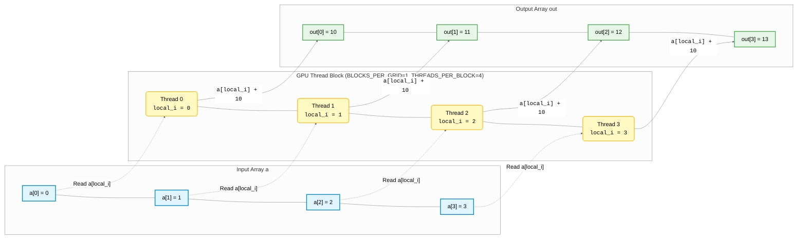

# Puzzle 1: Map

GPU programming is all about parallelism. In this puzzle, each thread will process a single element of the input array independently.
Implement a kernel that adds \\(10\\) to each position of vector \\(a\\) and stores it in vector \\(out\\). You have 1 thread per position.

original


vs mermaid with a lot more

<div class="mermaid-container">
    <div class="zoom-controls">
        <button onclick="zoomMermaid(1.2)" title="Zoom In">+</button>
        <button onclick="zoomMermaid(0.8)" title="Zoom Out">-</button>
        <button onclick="resetMermaidZoom()" title="Reset">Reset</button>
    </div>



</div>

## Key concepts

In this puzzle, you'll learn about:
- Basic GPU kernel structure
- Thread indexing with `thread_idx.x`
- Simple parallel operations

The key insight is that each thread \\(i\\) computes: \\[out[i] = a[i] + 10\\]

- **Parallelism**: Each thread executes independently
- **Thread indexing**: Access element at position \\(i = \\text{thread\_idx.x}\\)
- **Memory access**: Read from \\(a[i]\\) and write to \\(out[i]\\)
- **Data independence**: Each output depends only on its corresponding input

## Code to complete

```mojo
{{#include ../../../problems/p01/p01.mojo:add_10}}
```
<a href="{{#include ../_includes/repo_url.md}}/blob/main/problems/p01/p01.mojo" class="filename">View full file: problems/p01/p01.mojo</a>

<details>
<summary><strong>Tips</strong></summary>

<div class="solution-tips">

1. Store `thread_idx.x` in `local_i`
2. Add 10 to `a[local_i]`
3. Store result in `out[local_i]`
</div>
</details>

## Running the code

To test your solution, run the following command in your terminal:

```bash
magic run p01
```

Your output will look like this if the puzzle isn't solved yet:
```txt
out: HostBuffer([0.0, 0.0, 0.0, 0.0])
expected: HostBuffer([10.0, 11.0, 12.0, 13.0])
```

## Solution

<details>
<summary>Click to see the solution</summary>

```mojo
{{#include ../../../solutions/p01/p01.mojo:add_10_solution}}
```

<div class="solution-explanation">

This solution:
- Gets thread index with `local_i = thread_idx.x`
- Adds 10 to input value: `out[local_i] = a[local_i] + 10.0`
</div>
</details>


